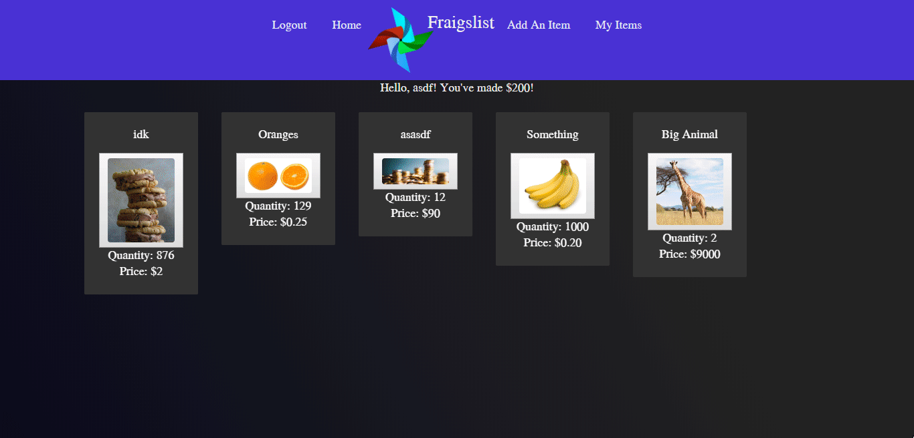
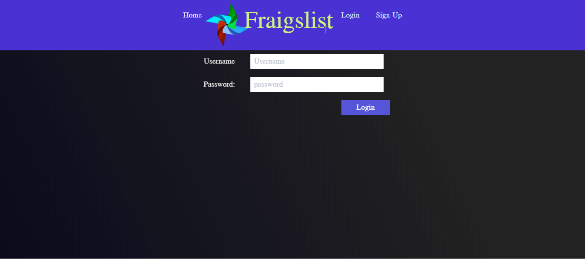

# Fraigslist

## **[Link to live site](https://limitless-dawn-67554.herokuapp.com/)**

### Prerequisites
You are free to use the site to browse without signing up, but if you want to do anything else, you're going to have to register for an account.
* Sign up
* Use a demo account. 

A demo account might previous items though. You can treat this as your personal sandbox and explore the limitations of our site. If you use a demo account, you won't be able to see the full features of our website!

```
* email: test || password: test 
* email: demo || password: demo
```

## Introduction

With this app you can shop for various goods. There are no limitations to what people can sell here! This project is an E-commernce app. You can buy whatever you want, or sell stuff if you choose to. If you decide to sell items, the app will keep track of how much money you've made for you. Nothing else to it!

### Using the app
To use the app outside of just window shopping, you'll have to signup to access your personal store. Once you log in, your navigation bar changes slightly. 

### Functions

1. Sign-Up

Before doing anything on our website, you'll probably want to sign up! It'll ask you a few simple things. Simply fill out the form, and you'll be good to go!


2. Adding a new item 

To add an item, hit the add item button in your nav bar. Once there, you will be required to input a new things.

``` 
* Item name
* Upload an image
* Quantity of your item(s)
* Price of your item
* The brand or company of the product
* Brief description 
```

Once you're finished with that, you'll be able to see it on our website's homepage! You will also be able to find the item in the my items tab.


3. Edit your item

After you add an item, you'll want to be able to adjust your items, of course! You can do this. Just hit the my items tab, find the one you want, and fill in what you want to change! If there are things you don't want to change, just leave it blank and it'll take what you previously had and submit it.



4. Delete item

If you have no more of your items to sell it will be removed from the home screen, but will still appear in your items. You can delete it from your store, if you have no more, or if you over listed your quantity.


5. Buy an item

If you want to buy an item, just click the picture to get the description of it to make sure what you want. It'll bring you to a new page, then you can input a quantity and buy!


6. Email notification

Once you buy an item, if you signed up with your real email, you will recieve a generic email. 



7. Errors

If you do some no-no's, our app will be upset with you and show you disapproval. 

If you miss input fields in your signup form, it'll show you what you missed and you'll have to try again. 


If you try to go to a weird path, it'll say we have no page for that.


##### That's pretty much it to how our website works!

## Technologies


* Node.js
* MongoDB
* Mongoose
* bcrypjt
* Passport
* Express
* NodeMailer
* Axios
* ReactStrap
* Bootstrap
* Axios


### Future Developments/Improvements

There are a lot of things that we would have liked to do, but couldn't accomplish in our time frame. We would have liked to have added an item of the day page/jumbotron. This will swap items every 24 hours, and discount them by a percentage. User's will have to opt into this. We would like to add a "Forgot Password" feature in case user's forget it. Another big thing we missed is a shopping cart so the app has a more real shopping experience. We weren't able to get to a lot of stylizing of the project, and could work on that. Lastly, we did not use any regex for verifications. 

## Authors

Orlando Corona, James Grodzicki, Snehal Thakkar, and Zaya Zaw